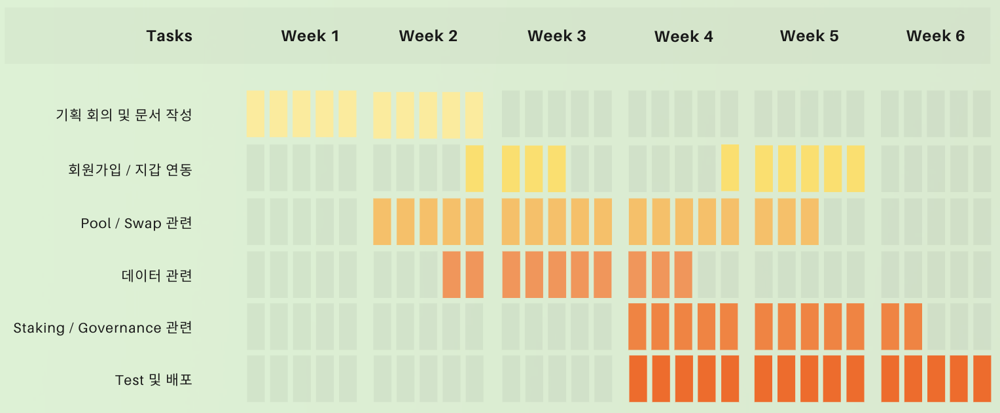
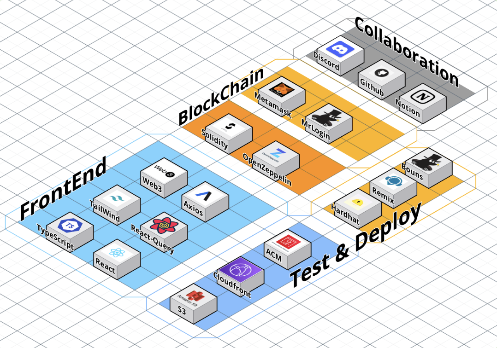
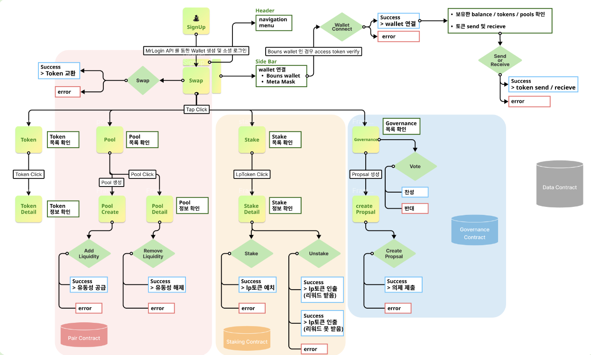
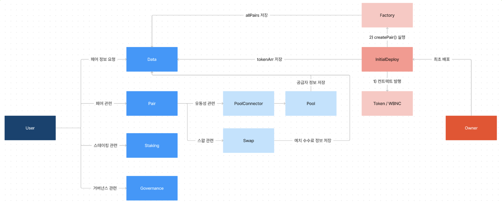
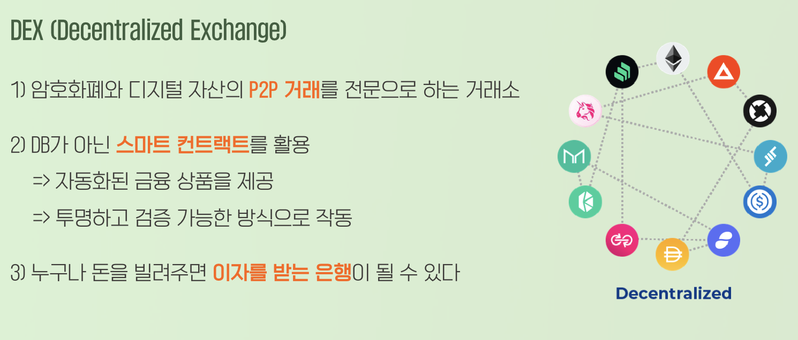
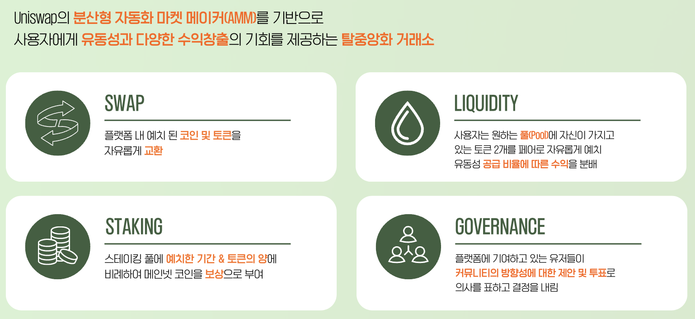

# [2023 기업협약] Bounswap
### Uniswap의 분산형 자동화 마켓 메이커(AMM)를 기반으로 사용자에게 토큰 교환, 유동성 공급 기능과 다양한 수익창출의 기회를 제공하는 탈중앙화 거래소(DEX)

 

## 목차
- [개요](#개요)
- [기술스택](#기술스택)
- [플로우차트 및 아키텍처](#플로우차트-및-아키텍처)
- [프로젝트 화면](#프로젝트-화면)

 

## 개요
- 프로젝트 이름 : Bounswap
- 프로젝트 url : https://www.bounswap.site/
- 프로젝트 gitHub
    - FrontEnd : https://github.com/9oodam/BounswapFront
    - Contract : https://github.com/9oodam/BounswapContract
- 프로젝트 목표 : 협업사 바운스코드의 네트워크 내에 존재하는 메인넷 코인과 토큰을 자유롭게 교환할 수 있는 DEX 플랫폼 제작
- 프로젝트 인원 : 5명
- 프로젝트 기간 : 2023.10.23 - 2023.12.05

 

## 기술스택
- FrontEnd : React, TailWind, TypeScript, AWS-S3, CloudFront
- Contract : Solidity, OpenZeppelin, Hardhat, Remix

 

## 플로우차트 및 아키텍처
- 플로우차트
    - 총 12페이지의 반응형 웹/앱
    - 백 서버/데이터베이스 없이 컨트랙트를 데이터베이스처럼 사용
    - 클라이언트 <-> 컨트랙트끼리의 상호작용으로 모든 기능 수행
- 아키텍처
    - 10개의 컨트랙트로 구성
    - 클라이언트는 4개의 라우터 컨트랙트에만 요청
    - Owner는 InitialDeploy 컨트랙트를 통해 최초에 필요한 모든 컨트랙트를 동적 배포

 

## 프로젝트 설명
- DEX란?
    - 온라인 상에서 암호화폐와 디지털 자산의 P2P 거래를 전문으로 하는 거래소
    - 스마트 컨트랙트를 활용하여 운영되기 때문에 번거로운 단계 없이 자동화된 금융 상품을 제공하고, 투명하고 검증 가능한 방식으로 작동
    - 사용자에게 수익 창출의 기회 제공
- Bounswap의 기획 및 목표
    - Swap: 플랫폼 내 예치 된 코인 및 토큰을 자유롭게 교환
    - Liquidity: 사용자가 원하는 토큰 2개를 페어(쌍)로 플랫폼에 존재하는 풀(Pool)에 원하는 양만큼 1:1로 예치하고 증서로 LP토큰을 부여받음, 해당 풀에서 스왑이 일어나면 유동성 공급자는 지분에 비례하여 수수료를 분배
    - Staking: 특정 LP토큰을 스테이킹 풀에 예치한 기간과 양에 따라 메인넷 코인(BNC)를 보상으로 부여, 일정기간 이후에 보상을 받을 수 있기 때문에 유동성을 오랫동안 안전하게 유지시킬 수 있는 장치
    - Governance: 커뮤니티의 방향성에 대한 제안과 투표로 의사를 표하고 결정을 내릴 수 있음

